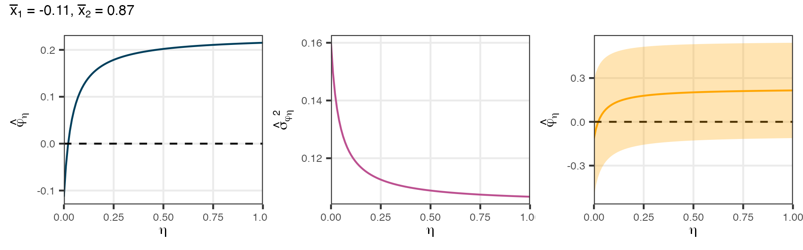
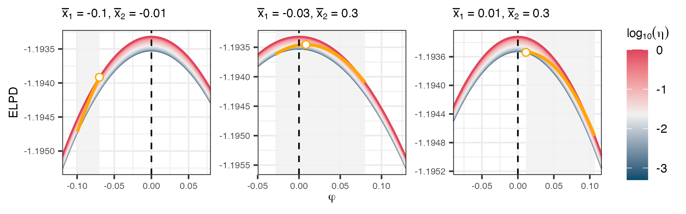
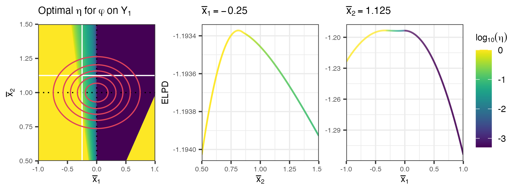
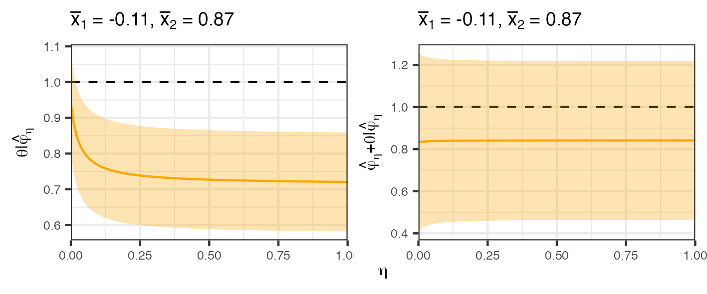
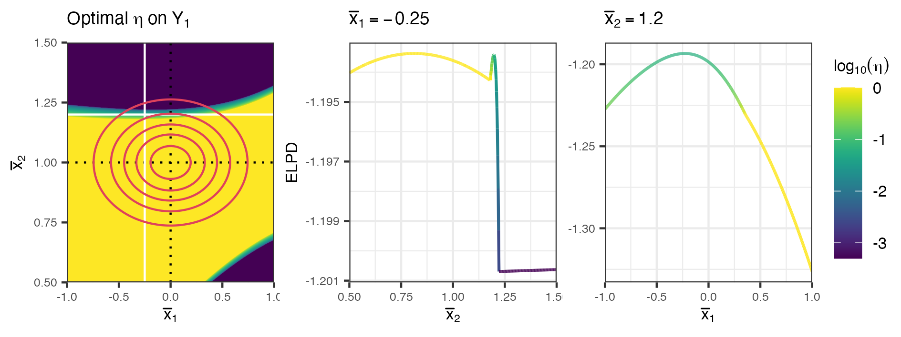

```{r message=FALSE}
# Import libraries
library(tidyverse)
library(ggplot2)
library(devtools)
library(patchwork)
library(purrr)
library(numDeriv)
library(calculus)
library(mvtnorm)
load_all()

# Set ggplot theme
theme_set(theme_bw())
```

## Setup

```{r}
# Fixed parameters
n <- 25; m <- 50; 
phi_true <- 0; theta_true <- 1;
s2z <- 4; s2y <- 1;

# Prior
s2t <- 0.5

const <- list(n = n,
              m = m,
              s2z = s2z,
              s2y = s2y,
              s2t = s2t)
```

## Analysis for $\varphi$

For a specific pair of $\bar{x}_1$ and $\bar{x}_2$, plot the posterior mean of $\varphi$ and $\sigma^2_{\varphi}$ as a function of $\eta$.

```{r fig.align = "center"}

```

### ELPD and optimal $\eta$

Plot the envelope of the ELPD and the curve as we vary $\eta$.

```{r fig.align = "center"}

```

Numerical differentiation of ELPD

```{r}
# The points at which the derivatives are to be evaluated
x <- seq(0, 1, length.out = 300)

# The numerical differentiation
y <- sapply(x, function(x) {
  calculus::derivative(elpd_phi_2,
                       var = c(eta = x),
                       params = list(x1 = -0.05, x2 = 0.3, const = const),
                       accuracy = 5,
                       stepsize = 1e-10,
                       order = 1)
})
```

### Grid evaluation for the optimal eta

To execute grid search for the first dataset

```{bash}
Rscript scripts/grid_search_phi.R -c "config_original"
```

To execute the grid search for the second dataset

```{bash}
Rscript scripts/grid_search_phi_theta.R -c "config_original"
```

Plot the heatmap for the optimal $\eta$ for the first dataset

```{r}

```

```{r}
df_eta_optim_phi <- readRDS("../results/optim_eta_1_original.rds")
```

### Calculate the probability of eta between 0 and 1

```{r}
fnames <- list.files("../results/", pattern = "optim_eta_1")
df_eta_optim_phi <- map_dfr(fnames, ~{
  exp_name <- stringr::str_remove(strsplit(.x, "_")[[1]][4], ".rds")
  fpath <- file.path("../results", .x)
  df <- readRDS(fpath)
  df$exp_name <- exp_name
  return(df)
})

df_eta_optim_phi <- df_eta_optim_phi %>%
  mutate(
    dx1 = dnorm(x1, mean = 0, sd = sqrt(4/n)),
    dx2 = dnorm(x2, mean = 1, sd = sqrt(1/m)),
    djoint = dx1 * dx2,
    pref_mod = ifelse(eta == 0, "full",
                      ifelse(eta > -3.3010, "smi", "cut"))
  ) %>%
  group_by(exp_name) %>%
  mutate(djoint_adj = djoint / sum(djoint)) %>%
  ungroup()

df_eta_optim_sum_1 <- df_eta_optim_phi %>%
  group_by(exp_name, pref_mod) %>%
  summarise(prob = sum(djoint_adj) * 100) %>%
  ungroup() %>%
  mutate(
    s2t = case_when(
      exp_name == "none" ~ 1,
      exp_name == "original" ~ 0.5,
      exp_name == "moderate" ~ 0.3,
      exp_name == "strong" ~ 0.1,
      exp_name == "extreme" ~ 0.01
    ),
    prob = round(prob, 2)
  ) %>%
  pivot_wider(names_from = pref_mod, values_from = prob) %>%
  arrange(desc(s2t))
```

## Analysis for $theta$

We begin by plotting the posterior mean of $\theta | \hat\varphi_\eta$ and $\hat\varphi_\eta \theta | \hat\varphi_\eta$.

```{r}

```

```{r}
# Case 3
zbar <- 0; ybar <- 1.22
phi_theta_0 <- phi_theta_mean(0, zbar, ybar, const)
phi_theta_1 <- phi_theta_mean(1, zbar, ybar, const)
plt_case_3 <- plot_elpd_phi_theta(phi_theta_0 - 0.03, phi_theta_1 + 0.03, zbar, ybar)
plt_case_3
```

### Grid evaluation for the optimal eta

```{r}

```

## Analysis for both sub-datasets

```{r}
library(plotly)
x1 <- seq(-3, 3, length.out = 100)
x2 <- seq(-3, 3, length.out = 100)
grid <- as.matrix(expand.grid(x1 = x1, x2 = x2))

eta <- 0.1
y <- apply(grid, 1, elpd_joint, 0.1, const)

plot_ly(x = grid[,1], y = grid[,2], z = y, type = "mesh3d", alpha = 0.3)
```

### Calculate the probability of eta between 0 and 1

```{r}
# Read result files from different grid search experiments
fnames <- list.files("../results/", pattern = "optim_eta_2")
df_eta_optim <- map_dfr(fnames, ~{
  exp_name <- stringr::str_remove(strsplit(.x, "_")[[1]][4], ".rds")
  fpath <- file.path("../results", .x)
  df <- readRDS(fpath)
  df$exp_name <- exp_name
  return(df)
})

# Approximate the probabilities for each model
df_eta_optim <- df_eta_optim %>%
  mutate(
    dx1 = dnorm(x1, mean = 0, sd = sqrt(4/n)),
    dx2 = dnorm(x2, mean = 1, sd = sqrt(1/m)),
    djoint = dx1 * dx2,
    pref_mod = ifelse(eta == 0, "full",
                      ifelse(eta > -3.3010, "smi", "cut"))
  ) %>%
  group_by(exp_name) %>%
  mutate(djoint_adj = djoint / sum(djoint)) %>%
  ungroup()

# Calculate the probability for each model being the optimal
df_eta_optim_sum_2 <- df_eta_optim %>%
  group_by(exp_name, pref_mod) %>%
  summarise(prob = sum(djoint_adj) * 100) %>%
  ungroup() %>%
  mutate(
    s2t = case_when(
      exp_name == "none" ~ 1,
      exp_name == "original" ~ 0.5,
      exp_name == "moderate" ~ 0.3,
      exp_name == "strong" ~ 0.1,
      exp_name == "extreme" ~ 0.01
    ),
    prob = round(prob, 2)
  ) %>%
  pivot_wider(names_from = pref_mod, values_from = prob) %>%
  arrange(desc(s2t))
```

```{r}
# Read result files from different grid search experiments
fnames <- list.files("../results/", pattern = "optim_eta_joint")
df_eta_optim <- map_dfr(fnames, ~{
  exp_name <- stringr::str_remove(strsplit(.x, "_")[[1]][4], ".rds")
  fpath <- file.path("../results", .x)
  df <- readRDS(fpath)
  df$exp_name <- exp_name
  return(df)
})

# Approximate the probabilities for each model
df_eta_optim <- df_eta_optim %>%
  mutate(
    dx1 = dnorm(x1, mean = 0, sd = sqrt(4/n)),
    dx2 = dnorm(x2, mean = 1, sd = sqrt(1/m)),
    djoint = dx1 * dx2,
    pref_mod = ifelse(eta == 0, "full",
                      ifelse(eta > -3.3010, "smi", "cut"))
  ) %>%
  group_by(exp_name) %>%
  mutate(djoint_adj = djoint / sum(djoint)) %>%
  ungroup()

# Calculate the probability for each model being the optimal
df_eta_optim_sum_3 <- df_eta_optim %>%
  group_by(exp_name, pref_mod) %>%
  summarise(prob = sum(djoint_adj) * 100) %>%
  ungroup() %>%
  mutate(
    s2t = case_when(
      exp_name == "none" ~ 1,
      exp_name == "original" ~ 0.5,
      exp_name == "moderate" ~ 0.3,
      exp_name == "strong" ~ 0.1,
      exp_name == "extreme" ~ 0.01
    ),
    prob = round(prob, 2)
  ) %>%
  pivot_wider(names_from = pref_mod, values_from = prob) %>%
  arrange(desc(s2t))
```

```{r}
library(kableExtra)

# Export probability tables
df_eta_optim_sum_1 <- df_eta_optim_sum_1 %>% mutate(data = 1)
df_eta_optim_sum_2 <- df_eta_optim_sum_2 %>% mutate(data = 2)
df_eta_optim_sum_3 <- df_eta_optim_sum_3 %>% mutate(data = 3)

# Export probability using kableExtra as latex code
rbind(df_eta_optim_sum_1, df_eta_optim_sum_2, df_eta_optim_sum_3) %>%
  select(data, s2t, cut, smi, full) %>%
  kbl("latex",
      booktabs = T,
      label = "model-prob",
      caption = "Approximate probabilities for the optimal model under different prior misspecifications") %>%
  add_header_above(c(" " = 2, "Probability" = 3)) %>%
  kableExtra::kable_styling(latex_options = c("hold_position", "striped")) %>%
  cat()
```
